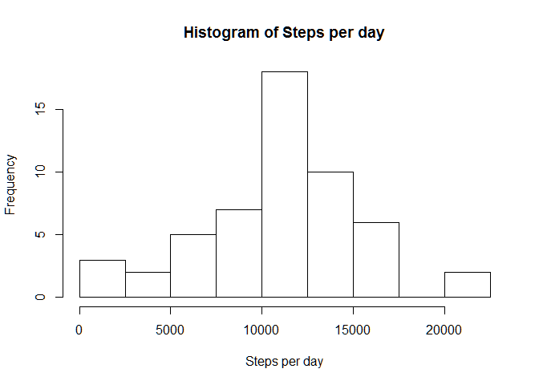
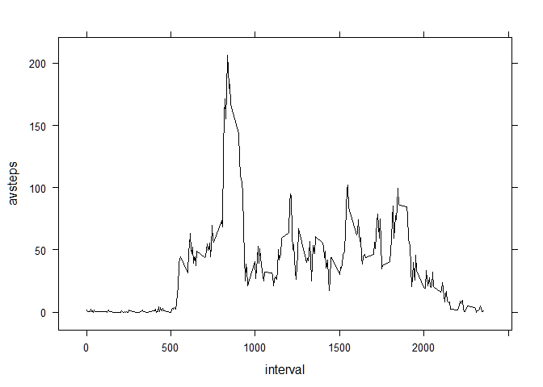
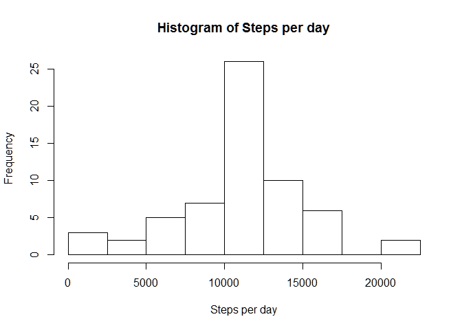
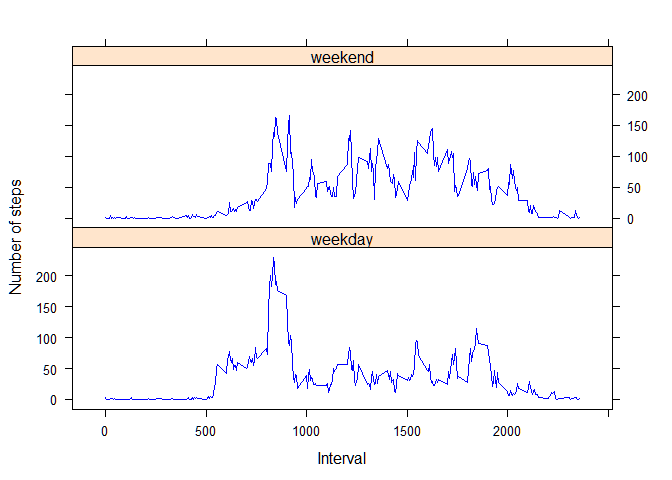

# Reproducible Research: Peer Assessment 1


## Loading and preprocessing the data

First we unzip the file and read the csv within.


```r
# unzip the activity file from the repository
unzip("activity.zip")

# read the data into a data frame
d1 <- read.csv("activity.csv")
```

The assignment page states there are a total of 17568 observations and that there
are three variables: 

 - steps: Number of steps taking (sic) in a 5-minute interval (missing values are coded as NA)
 
 - date: The date on which the measurement was taken in YYYY-MM-DD format
 
 - interval: Identifier for the 5-minute interval in which the measurement was taken.
            
Let's check that we have the correct number of observations and the correct
variables.


```r
# check the contents of the data frame
str(d1)
```

```
## 'data.frame':	17568 obs. of  3 variables:
##  $ steps   : int  NA NA NA NA NA NA NA NA NA NA ...
##  $ date    : Factor w/ 61 levels "2012-10-01","2012-10-02",..: 1 1 1 1 1 1 1 1 1 1 ...
##  $ interval: int  0 5 10 15 20 25 30 35 40 45 ...
```


## What is mean total number of steps taken per day?

To create a histogram of the number of steps taken per day, we must first
create the sum of steps per day. To do this, we can use summarise in the dplyr
package. 


```r
# ensure that dplyr is installed and loaded
require(dplyr)
```

```
## Loading required package: dplyr
```

```
## Warning: package 'dplyr' was built under R version 3.3.2
```

```
## 
## Attaching package: 'dplyr'
```

```
## The following objects are masked from 'package:stats':
## 
##     filter, lag
```

```
## The following objects are masked from 'package:base':
## 
##     intersect, setdiff, setequal, union
```

```r
# create a copy of the original data frame without rows where steps = NA
d2 <- d1[!is.na(d1$steps),]

# create a data frame grouping by date and summing the number of steps
hdata <- summarise(group_by(d2,date),stepsum = sum(steps))

# check the contents of the data frame (make sure there are 288 rows)
str(hdata)
```

```
## Classes 'tbl_df', 'tbl' and 'data.frame':	53 obs. of  2 variables:
##  $ date   : Factor w/ 61 levels "2012-10-01","2012-10-02",..: 2 3 4 5 6 7 9 10 11 12 ...
##  $ stepsum: int  126 11352 12116 13294 15420 11015 12811 9900 10304 17382 ...
```

When creating a histogram without specifying the breaks, there were only 5 breaks.
It looked like th range was from zero to approximately 20000. It might be more 
useful if we had more breaks. We could double the number of bars by breaking 
every 2500 steps.


```r
# use a variable for break size in case it needs to be changed
breaksize <- 2500

# create the histogram
# the end of the seq range is just rounding the max value up to the nearest 
# multiple of 2500
hist(hdata$stepsum
     ,breaks = seq(0
                   ,breaksize * round((max(hdata$stepsum) + breaksize) / breaksize)
                   ,by=breaksize)
     ,main = "Histogram of Steps per day"
     ,xlab = "Steps per day")
```

<!-- -->

The mean and median steps per day can be calculated from the same data frame.


```r
# store the mean of the sum of steps in case we need it later
stepmean <- mean(hdata$stepsum)

# store the median of the sum of steps in case we need it later
stepmedian <- median(hdata$stepsum)

# print the mean of the sum of steps
stepmean
```

```
## [1] 10766.19
```

```r
# print the median of the sum of steps
stepmedian
```

```
## [1] 10765
```


## What is the average daily activity pattern?

Let's see what the average number of steps taken in each of the 5-minute 
intervals was over the 61 days. 

First we need to get the average of each of the 24 * 12 = 288 time intervals.


```r
# create a data frame grouping by interval and taking the mean of the steps
ldata <- summarise(group_by(d2,interval),avsteps = mean(steps))
```

Next we can create a plot with the interval on the x-axis and the average steps 
on the y-axis.


```r
# ensure lattice is installed and loaded
require(lattice)
```

```
## Loading required package: lattice
```

```r
# create a line chart of avsteps against interval
xyplot(avsteps ~ interval
       ,data = ldata
       ,type = "l"
       ,lwd = 1
       ,lty = 1
       ,col.line = c("black")
)
```

<!-- -->

It looks like the most active 5-minute interval is some time between 0500 and 
1000.

We can find the record in the ldata tibble to find which interval exactly was
the most active.


```r
# find the row with the maximum value in the avsteps column
ldata[ldata$avsteps == max(ldata$avsteps),1]
```

```
## # A tibble: 1 × 1
##   interval
##      <int>
## 1      835
```

So, it turns out the most active interval is the one beginning at 0835.


## Imputing missing values

The calculations above excluded missing values (coded as NA in the steps 
variable).

We should be careful that excluding these records are not introducing bias into
those calculations. 

The total number of rows with missing values can be calculated easily:


```r
# count the number of na rows
count(d1[is.na(d1$steps),])
```

```
## # A tibble: 1 × 1
##       n
##   <int>
## 1  2304
```

With 2304 missing values, it is worth investigating whether imputing those values
and recalculating some of the statistics above would tell us anything different
about the activity data. 

From the line chart above, we might assume that activity varies 
throughout the day, so it is probably not appropriate to filling missing data
with a mean across intervals, but instead to fill them with a mean across 
days. i.e. we should use the mean of non-NA steps in all intervals and use those
values to replace the NA values. 

The mean steps per interval are in ldata. The original data frame including 
the NA rows is d1.


```r
# join the two tables together
d3 <- inner_join(x = d1, y = ldata, by = c("interval" = "interval"))

# for rows with steps=NA, use the value in avsteps
d3[is.na(d3$steps),"steps"] <- d3[is.na(d3$steps),"avsteps"]

# remove avsteps
d3 <- d3[,1:3]

# check there are no na values remaining
count(d3[is.na(d3$steps),])
```

```
## # A tibble: 1 × 1
##       n
##   <int>
## 1     0
```


Now we can recreate the histogram of total number of steps per day.


```r
# create a data frame grouping by date and summing the number of steps
hdata2 <- summarise(group_by(d3,date),stepsum = sum(steps))

# create the histogram
# the end of the seq range is just rounding the max value up to the nearest 
# multiple of 2500
hist(hdata2$stepsum
     ,breaks = seq(0
                   ,breaksize * round((max(hdata2$stepsum) + breaksize) / breaksize)
                   ,by=breaksize)
     ,main = "Histogram of Steps per day"
     ,xlab = "Steps per day")
```

<!-- -->

The mean and median steps per day can be calculated from the same data frame.


```r
# store the mean of the sum of steps in case we need it later
stepmean2 <- mean(hdata2$stepsum)

# store the median of the sum of steps in case we need it later
stepmedian2 <- median(hdata2$stepsum)

# print the mean of the sum of steps
stepmean2
```

```
## [1] 10766.19
```

```r
# print the median of the sum of steps
stepmedian2
```

```
## [1] 10766.19
```


These values of mean and median differ, but only slightly, from the values 
calculated on the data set where NA rows were excluded.


```r
# calculate the difference between the original and imputed means
stepmean - stepmean2
```

```
## [1] 0
```

```r
# calculate the difference between the original and imputed medians
stepmedian - stepmedian2
```

```
## [1] -1.188679
```

The estimates of the mean are actually the same. This makes sense, because 
replacing all missing values with the mean would not change the distribution.

The estimates of the median are slightly different. Imputing missing values
with the mean for each interval has had the effect of moving the median towards
the mean. Actually the median is now the same as the mean (correct to two decimal
places).


## Are there differences in activity patterns between weekdays and weekends?


```r
# calculate the weekend factor
# working outwards, we convert the date factor to a date of type character
# then convert that to POSIXct so it can be used with the weekdays function
# the weekdays function converts each date to a value in ["Mon":"Sun"]
# then we can use sapply to convert the weekday values to either weekend or 
# weekday and finally convert that vector to a factor and assign it to the new
# column in the dataframe
d3[,"weekend"] <- as.factor(
                        sapply(weekdays(as.POSIXct(as.character(d3$date)),abbreviate = TRUE)
                                ,function(x) if(x == "Sun"|x == "Sat") {
                                                "weekend"
                                                } else {
                                                "weekday"
                                                }
                               )
                        )

# look at the data frame to make sure we have a factor for weekend
str(d3)
```

```
## 'data.frame':	17568 obs. of  4 variables:
##  $ steps   : num  1.717 0.3396 0.1321 0.1509 0.0755 ...
##  $ date    : Factor w/ 61 levels "2012-10-01","2012-10-02",..: 1 1 1 1 1 1 1 1 1 1 ...
##  $ interval: int  0 5 10 15 20 25 30 35 40 45 ...
##  $ weekend : Factor w/ 2 levels "weekday","weekend": 1 1 1 1 1 1 1 1 1 1 ...
```


Now we can create a line plot by first summarizing the data by weekend and interval.


```r
# create a data frame grouping by interval and taking the mean of the steps
ldata2 <- summarise(group_by(d3,weekend,interval),avsteps = mean(steps))
```

Next we can create a plot with the interval on the x-axis and the average steps 
on the y-axis and panel by weekend


```r
# ensure lattice is installed and loaded
require(lattice)

# create a line chart of avsteps against interval
xyplot(avsteps ~ interval | weekend
       ,data = ldata2
       ,type = "l"
       ,lwd = 1
       ,lty = 1
       ,col.line = c("blue")
       ,layout = c(1,2)
       ,xlab = "Interval"
       ,ylab = "Number of steps"
)
```

<!-- -->
